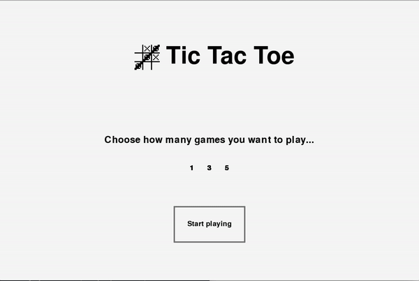

# tic-tac-toe

Simple Tic-Tac-Toe game to learn pygame

## Steps

Install the dependencies:

```python install -r requirements.txt```

Run the game:

```python run.py```

<br>

## Animation

<br>


